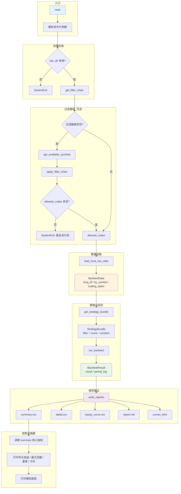

# pybroker_fund_backtest.py 执行流程图

## 整体流程概览



## 阶段拆解

### 1. 命令行参数解析

| 参数 | 说明 | 默认值 |
|------|------|--------|
| `--nav-dir` | 净值/run data 目录 | 最新 run 的 data |
| `--strategy` | 策略包名 | `low_risk_debt` |
| `--max-funds` | 最多加载基金数 | 200 |
| `--start-date` / `--end-date` | 回测日期范围 | 2023-01-01 ~ 2025-12-31 |
| `--rebalance` | 调仓周期（交易日） | 20 |
| `--top-n` | 持仓基金数 | 3 |
| `--warmup` | 策略预热 bar 数 | 243 |
| `--initial-cash` | 初始资金 | 100_000 |
| `--output-dir` | 输出目录 | `output/pybroker_backtest` |

### 2. 过滤器链（可选）

依赖环境变量 `FUND_BACKTEST_FILTERS`（逗号分隔），如：

```
FUND_BACKTEST_FILTERS=filtered_candidates,max_funds
```

- `get_filter_chain()`：解析环境变量，按顺序实例化过滤器
- `get_available_symbols(nav_dir)`：从 `fund_adjusted_nav_by_code` 下扫描 CSV 得基金编码
- `apply_filter_chain(candidates, filters)`：依次应用过滤器，得到 `allowed_codes`
- 若无过滤器，`allowed_codes` 为 `None`，加载时不做基金范围限制

### 3. 数据加载 (load_fund_nav_data)

- 解析 `nav_dir`：支持直接净值目录或 `run/data/fund_etl/fund_adjusted_nav_by_code`
- 读取 CSV（`基金代码`、`净值日期`、`复权净值`），按日期筛选
- 输出 `BacktestData`：`long_df`（OHLC 长表）、`by_symbol`、`trading_dates`

### 4. 策略包 (get_strategy_bundle)

- 从注册表按名称获取 `StrategyBundle`
- 内含：`filter_strategy`（过滤）、`score_strategy`（打分）、`position_strategy`（权重）
- 可选策略：`low_risk_debt`、`low_risk_debt_most_stable`

### 5. 回测引擎 (run_backtest)

- `_build_rebalance_dates`：根据调仓周期生成调仓日
- 在调仓日调用 `before_exec`：过滤 → 打分 → 权重
- `execute`：按目标权重执行买卖
- 返回 `BacktestResult`（PyBroker 结果 + `period_log`）

### 6. 报告写入 (write_reports)

| 输出文件 | 内容 |
|----------|------|
| `summary.csv` | 运行配置、数据信息、指标（年化收益、最大回撤、夏普等） |
| `detail.csv` | 每期调仓明细、买卖记录、期间收益 |
| `equity_curve.csv` | 每日净值曲线 |
| `orders.csv` | 订单明细 |
| `report.md` | 可读报告 |
| `curves.html` | 收益曲线可视化（若生成） |

### 7. 控制台输出

- 从 `summary.csv` 读取 `metrics_holding` 段
- 打印关键指标：年化收益率、最大回撤率、夏普比率、卡玛比率、年化波动率
- 打印各报告文件路径
