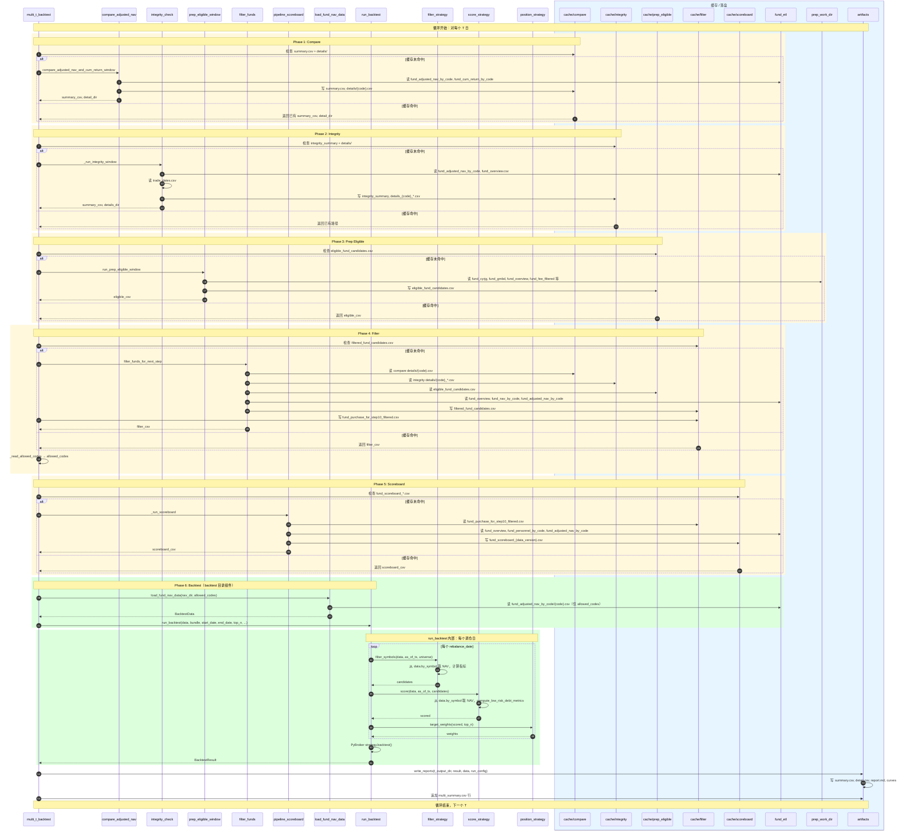

# multi_t_backtest 时序图

以单个 T 日为例，描述 multi_t_backtest、backtest 组件、落盘缓存之间的流程与数据读写关系。



---

## 参与对象说明

| 对象 | 类型 | 说明 |
|------|------|------|
| **multi_t_backtest** | 脚本 | 主流程编排，循环每个 T 日 |
| **compare_adjusted_nav** | v2.compare | 本地复权 vs 远程 cum_return 一致性比对 |
| **integrity_check** | check_trade_day_data_integrity | 交易日数据完整性检查 |
| **prep_eligible_window** | v2.filters | 从 prep_work 做 eligible 筛选 |
| **filter_funds** | v2.filters | 结合 compare+integrity 做规则 1–5 过滤 |
| **pipeline_scoreboard** | pipeline_scoreboard | 打分排序（本流程中 skip_sinks，仅写 CSV） |
| **load_fund_nav_data** | backtest.data | 加载 NAV 为 BacktestData |
| **run_backtest** | backtest.engine | 回测执行，调 PyBroker |
| **filter_strategy** | bundle 内 | PassThroughFilter / MostStableFilterStrategy |
| **score_strategy** | bundle 内 | LowRiskDebtScoreStrategy |
| **position_strategy** | bundle 内 | EqualWeightPosition |
| **cache/*** | 磁盘 | compare/integrity/prep_eligible/filter/scoreboard 缓存目录 |
| **fund_etl** | 磁盘 | run_full_pipeline 产出的 L1 数据 |
| **prep_work_dir** | 磁盘 | prep_data_workflow 产出的 cyrjg/gmbd/overview/fee 等 |
| **artifacts** | 磁盘 | 回测报告、multi_summary.csv |

---

## 数据传递关系简图

```
                    ┌──────────────────────────────────────────────────────────┐
                    │                    fund_etl (L1)                          │
                    │  fund_adjusted_nav_by_code, fund_cum_return_by_code,      │
                    │  fund_overview, fund_nav_by_code, fund_personnel_by_code  │
                    └──────────────────────────────────────────────────────────┘
                         │           │           │           │           │
                         ▼           ▼           ▼           ▼           ▼
              compare   integrity  filter    scoreboard   load_fund_nav_data
                         │           │           │
                         ▼           ▼           ▼
                    ┌──────────────────────────────────────────────────────────┐
                    │                    prep_work_dir                         │
                    │  fund_cyrjg, fund_gmbd, fund_overview, fund_fee_filtered  │
                    └──────────────────────────────────────────────────────────┘
                         │
                         ▼
                    prep_eligible
                         │
                         ▼
                    filter (allowed_codes) ──────────────────────────────────────┐
                         │                                                      │
                         ▼                                                      ▼
                    load_fund_nav_data(allowed_codes) ─────► BacktestData ──► run_backtest
                                                                                  │
                                                                                  ▼
                                                                            filter_strategy
                                                                            score_strategy
                                                                            position_strategy
                                                                                  │
                                                                                  ▼
                                                                            PyBroker
```

---

## 缓存目录结构

```
data/versions/{run_id}/cache/v2/
├── compare/{ruleset_version}/{start}_{end}/
│   ├── summary.csv
│   └── details/{code}.csv
├── integrity/{ruleset_version}/{start}_{end}/
│   ├── trade_day_integrity_summary_{start}_{end}.csv
│   └── details_{start}_{end}/{code}_{start}_{end}.csv
├── prep_eligible/{ruleset_version}/{start}_{end}/
│   └── eligible_fund_candidates.csv
├── filter/{ruleset_version}/{start}_{end}/
│   ├── filtered_fund_candidates.csv
│   └── fund_purchase_for_step10_filtered.csv
└── scoreboard/{ruleset_version}/{as_of_date}/{start}_{end}/
    └── fund_scoreboard_{run_id}_{ruleset}_{as_of}.csv

artifacts/backtest_multi/{run_id}/{ruleset_version}/
├── {as_of_date}/          # 每个 T 日
│   ├── summary.csv
│   ├── detail.csv
│   ├── report.md
│   └── ...
└── multi_summary.csv
```
